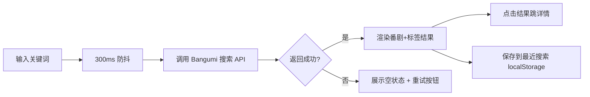

# 番录 (FanLu) — 产品需求文档 (PRD)

> 文档目的：把"做一个类似 yuc.wiki 的动漫资讯站"这个模糊想法，拆成可验收的页面、模块与流程。
> 阅读对象：作者本人（求职作品集项目）、面试官、协作者。
> 关联文档：[技术架构文档](./tech-architecture.md)

---

## 0. 写在前面：这份文档怎么读

如果你第一次接触 PRD，建议按下面的顺序看：
1. 第 1 章：5 分钟内了解整个产品是什么、为什么做。
2. 第 2 章：搞清楚用户能看到哪些页面、点完一个流程会发生什么。
3. 第 3 章：具体的页面长什么样、有什么细节。
4. 第 4 章：设计风格，决定产品的"颜值"基调。
5. 第 5 章：会列出常见问题和指标，方便你面试时回答"为什么这么做"。

---

## 1. 产品概述

**番录 (FanLu)** 是一个面向二次元爱好者的个人向动漫追踪与资讯站，参考 [yuc.wiki](https://yuc.wiki/) 的"季度新番表"模式，加入个人追番、评分、评论等个性化能力，定位为"个人动漫信息中心"。

- **核心定位**：以季度新番时间表为主入口，结合个人追番库、内容详情、标签筛选、社区互动。
- **目标用户**：
  - 主用户：二次元爱好者 / ACG 文化关注者（追番、了解新番动态）。
  - 次要读者：作品集面试官（评估前端工程能力、设计能力、问题解决能力）。
- **产品价值**：
  - 用户：在一个页面看完整季度新番安排，告别"找 N 个网站拼凑"。
  - 作者（你）：作为求职作品集，全方位展示 Vue 3 / 移动端适配 / 性能优化 / PWA / 开放 API 集成能力。
- **范围与不做的事**：
  - ✅ 做：浏览新番、查看详情、追番、评分、评论、筛选、PWA 安装。
  - ❌ 不做：用户登录注册、聊天、社区私信、视频播放、付费会员、商家后台。

> **为什么不做"用户登录"？** 因为产品定位是"个人向"，用户数据全部存在浏览器本地（IndexedDB），无后端、无服务器成本。面试时这是个亮点决策：能在 "无后端" 约束下设计"看起来像有后端"的产品。

---

## 2. 核心功能

### 2.1 用户角色

本产品无登录体系，所有用户行为都在本机存储。角色简化如下：

| 角色 | 入口 | 核心权限 |
|------|------|----------|
| 访客 | 首次访问 | 浏览所有公开内容（新番表、详情、评论列表） |
| 本机用户 | 浏览器内自动生成匿名 ID | 访客权限 + 追番、评分、评论、查看个人时间线 |

> **为什么这样设计？** 不做登录的好处：① 零合规风险（GDPR 个人信息）；② 离线可用（PWA 完美场景）；③ 简化产品。坏处是"多设备不同步"，但作品集项目这点不重要。

### 2.2 功能模块

总共 7 个核心页面，按使用路径排序：

1. **首页 (Home)**：当前季度新番表（按星期分组），本周即将开播番剧高亮。
2. **新番列表页 (Schedule)**：可切换季度、按类型/平台/状态筛选，扁平卡片展示。
3. **番剧详情页 (Detail)**：番剧信息（封面、简介、声优、staff、平台）、用户评分分布、个人追番按钮、剧集列表、评论。
4. **我的追番页 (Library)**：分"在看 / 想看 / 看过 / 弃番"四状态，展示个人评分与更新时间线。
5. **搜索页 (Search)**：按番剧名 / 声优 / tag 搜索，结果可筛选。
6. **归档页 (Archive)**：历年春/夏季新番列表（致敬 yuc.wiki 的 archives），可按年份翻页。
7. **个人中心页 (Profile)**：本地数据统计、主题切换（明/暗）、PWA 安装入口、数据导出/清空。

### 2.3 页面细节

| 页面 | 模块 | 功能描述 |
|------|------|----------|
| 首页 | Hero 区 | 大字标题"番录" + 当前季度副标题 + 一句 Slogan，背景为低透明度噪点纹理 + 当前季度新番拼接图。 |
| 首页 | 周维度分组 | 7 个 Tab 切换 周一-周日 + "今天"，今天默认展开，显示当天全部番剧。 |
| 首页 | 单条番剧卡片 | 显示封面缩略图、片名、首播时间、平台徽标（B站 / 腾讯 / 爱奇艺 / Crunchyroll 等）。 |
| 新番列表 | 筛选器 | 顶部 sticky 的筛选条：季度选择、类型（爱情/热血/校园/...）、平台、状态（未开播/连载中/已完结）。 |
| 新番列表 | 卡片网格 | 移动端 1 列、平板 2 列、桌面 3-4 列。 |
| 番剧详情 | 信息头部 | 大封面 + 片名 + 集数 + 播出日期 + 评分。 |
| 番剧详情 | 信息 Tab | "简介 / 声优 / STAFF / 平台 / 剧集 / 评论" 6 个 Tab。 |
| 番剧详情 | 个人操作 | 右下浮动按钮：追番（未追→在看→已看→重看 四态循环），长按弹出菜单。 |
| 我的追番 | 状态 Tab | "在看 / 想看 / 看过 / 弃番" 4 个 Tab + 数量徽标。 |
| 我的追番 | 卡片项 | 封面 + 片名 + 我的评分（1-10 星，可改） + 个人备注。 |
| 搜索 | 输入区 | 顶部搜索框，实时联想（300ms 防抖），最近搜索记录。 |
| 搜索 | 结果区 | 番剧结果（卡片）+ 标签结果（chip）。 |
| 归档 | 年份卡片 | 按春夏秋冬 4 个季节聚合，季节块可折叠。 |
| 个人中心 | 数据卡片 | "已追 N 部 / 评分 N 次 / 评论 N 条" 三张统计卡。 |
| 个人中心 | 偏好设置 | 主题切换（明 / 暗 / 跟随系统）、默认首页（新番表/追番/归档）、是否开启推送。 |
| 个人中心 | 数据管理 | "导出 JSON 备份" / "清空本地数据" 两个危险操作。 |

---

## 3. 核心流程

### 3.1 首次访问流程

```mermaid
flowchart TD
    A[用户打开 yuc.fanlu.app] --> B[Service Worker 检查更新]
    B --> C{本地是否有缓存版本?}
    C -- 有 --> D[展示缓存内容 + 后台更新]
    C -- 无 --> E[展示骨架屏 + 拉取 Bangumi API]
    E --> F[渲染首页新番表]
    D --> F
    F --> G{用户是否安装 PWA?}
    G -- 是 --> H[主页图标直接打开，无地址栏]
    G -- 否 --> I[顶部出现"添加到主屏幕"提示横幅]
```

### 3.2 追番流程

```mermaid
flowchart TD
    A[用户在详情页点击追番] --> B{当前追番状态?}
    B -- 未追 --> C[写入 IndexedDB: status=在看, addedAt=now]
    B -- 在看 --> D[弹出菜单: 已看/想看/弃番]
    B -- 想看 --> E[修改状态为想看]
    B -- 已看 --> F[弹出评分弹窗 1-10 星]
    B -- 弃番 --> G[二次确认后修改]
    C --> H[卡片右下角出现"在看"徽标]
    D --> H
    E --> H
    F --> H
    G --> H
    H --> I[同步更新"我的追番"页]
```

### 3.3 搜索流程



---

## 4. 用户界面设计

### 4.1 设计风格

> 设计目标：**日式编辑设计 (Japanese Editorial)** —— 兼具博客的温度感与现代产品的克制。参考 Brutus Casa、Popeye 杂志、Yuc.wiki。

#### 配色

- **主色（明）**：`#1A1A1A`（文字）/ `#F4F1EC`（米白背景）/ `#E63B2E`（朱红强调）
- **主色（暗）**：`#F4F1EC`（文字）/ `#161616`（深黑背景）/ `#FF6E5A`（暖橙强调）
- **辅助色**：`#6B6B6B`（次级文字）/ `#D9D2C7`（分隔线）/ `#3A8FB7`（链接蓝）
- **平台徽标色**：B站粉、爱奇艺绿、腾讯蓝、Crunchyroll橙，按平台取真实品牌色，便于识别。

#### 字体

- **中文显示**：`思源宋体 SC` / `Noto Serif SC`（标题端庄）+ `思源黑体 SC` / `Noto Sans SC`（正文易读）
- **英文显示**：`Fraunces`（显示，带古典衬线感）/ `Inter`（正文）
- **数字**：`JetBrains Mono`（用于时间、集数等 tabular 数据）
- **字体大小体系**（8px 基准）：12 / 14 / 16 / 18 / 20 / 24 / 32 / 48 / 72

#### 按钮

- **主按钮**：纯文字 + 下划线（编辑感），hover 时下划线变红。
- **次按钮**：米色背景 + 1px 边框。
- **危险按钮**：红色文字，无背景，hover 时反向填充。

#### 布局

- **栅格**：桌面 12 列 / 平板 8 列 / 手机 4 列，gutter 24px。
- **卡片**：圆角 0（保持编辑感），用 1px 细线 + 大留白分割。
- **图标**：lucide 图标库 1.5px 描边，不上彩色，保持单色克制。

#### 微动效

- 页面切换：横向淡入 + 12px 上移，200ms。
- 卡片 hover：边框由 `1px solid #D9D2C7` 变 `1px solid #E63B2E`，150ms。
- 列表加载：骨架屏，1.4s 循环脉冲。
- 评分交互：星 hover 时弹跳 1.1 倍，选中后保持红色填充。

### 4.2 页面设计概览

| 页面 | 视觉重点 |
|------|----------|
| 首页 | 顶部大字号标题"番录 / 2026 Spring"，下面紧跟 7 Tab 周维切换，今天 Tab 突出。 |
| 新番列表 | 顶部 sticky 筛选条，主体是大封面卡片网格，移动端单列。 |
| 番剧详情 | 头图采用 16:9 大封面，片名用 48px 衬线斜体，信息 Tab 切换有过渡。 |
| 我的追番 | 4 Tab + 数量徽标，卡片用"封面 + 文字"左右布局，移动端竖排。 |
| 搜索 | 输入框占据焦点，结果按"番剧 / 标签 / 声优"分块。 |
| 归档 | 时间线式布局，按季度分割。 |
| 个人中心 | 数据统计卡片 + 设置分组列表。 |

### 4.3 响应式

- **断点**：`sm 640 / md 768 / lg 1024 / xl 1280 / 2xl 1536`
- **设计策略**：
  - 移动端：单列、底部 TabBar 导航、Hero 文字更小、卡片列表滑动。
  - 平板：双列、顶部 Tab 导航。
  - 桌面：3-4 列、左侧固定侧边栏 + 右侧主内容（详情页）。
- **触控优化**：
  - 移动端所有可点击元素最小 44×44px。
  - 列表项使用 `touch-action: manipulation` 防止 300ms 延迟。
  - 下拉刷新用原生手势。
- **暗色模式**：
  - 使用 `prefers-color-scheme` 默认跟随系统。
  - 用户可手动锁定（写入 localStorage）。
  - 暗色模式用深色背景 + 暖色文字，避免纯白对比刺痛。

### 4.4 性能与可访问性

- 首屏 LCP < 2.5s（关键图片用 `loading="lazy"` + 压缩 WebP）。
- 路由切换用懒加载（`defineAsyncComponent`）。
- 所有交互元素带 focus 可见态（`focus-visible`）。
- 颜色对比度满足 WCAG AA（文字 4.5:1，大字 3:1）。
- 键盘可达：Tab 顺序合理、ESC 关闭弹窗、↑↓ 切换 Tab。

---

## 5. 常见问题与面试回答参考

> 这一章专门给"你不是从零做项目、面试怕被问"准备的。每个问题都列出**标准答案思路**，你照着练就行。

### Q1：你为什么选 Vue 3 + Vite 而不是 React？

**回答思路**：
- Vue 3 的 Composition API 是模块化逻辑的最优解（关注点分离比 React Hooks 直观），符合 2024+ 趋势。
- Vite 的 dev server 基于原生 ESM，HMR 几乎瞬时，DX 优秀。
- 我对 Vue 生态更熟悉（Pinia / Vue Router / 官方 Vite 插件）。
- React 不是不好，但选最熟的技术栈写出高质量代码，比硬上不熟的栈更显能力。

### Q2：为什么不做后端？用户数据怎么存？

**回答思路**：
- 产品定位是"个人向"，无须账号体系。
- 用浏览器 IndexedDB 存"我的追番 / 评分 / 评论"，localStorage 存"偏好设置 / 最近搜索"。
- IndexedDB 是浏览器内 NoSQL，支持事务、索引，容量大（一般 50% 磁盘空间），比 localStorage（5MB）更适合结构化数据。
- 用户可一键导出 JSON 备份，未来如果要加后端，只需替换 `src/api/local.ts` → `src/api/http.ts` 的实现，调用方零改动。

### Q3：Bangumi API 限流怎么办？数据怎么缓存？

**回答思路**：
- Bangumi 公开 API 限流约 60 req/min。
- 策略：① 静态元数据（番剧详情）用 SWR 模式缓存 24h；② 同一页面并发请求用 `Promise.all`；③ 列表页用"按需加载 + 虚拟滚动"减少请求次数。
- 离线场景：PWA 用 Workbox 缓存 API 响应（CacheFirst / StaleWhileRevalidate），断网时返回上次的缓存。

### Q4：你怎么排查过什么 bug？

**回答思路（举一个真实案例）**：
- 案例 1：移动端 `position: fixed` 在 iOS Safari 底部工具栏缩放时会跳动 → 用 `env(safe-area-inset-bottom)` + 隐藏时降级为 `position: absolute`。
- 案例 2：Bangumi API 返回的图片跨域被 canvas tainted → 用 `crossOrigin="anonymous"` + 失败时降级显示默认封面。
- 案例 3：IndexedDB 在 Safari 隐身模式下不可写 → 检测 `navigator.storage.estimate()` 给出友好提示。

### Q5：性能指标你怎么盯的？

**回答思路**：
- 用 Vite 的 `rollup-plugin-visualizer` 产物体积报告，目标 main bundle < 200KB gzipped。
- 用 Web Vitals 库采集 LCP / FID / CLS，写入 console 调试。
- Lighthouse CI 在 GitHub Actions 跑，目标 Performance > 90、Accessibility > 95、Best Practices > 95。

### Q6：PWA 怎么做的？Service Worker 怎么写？

**回答思路**：
- 用 `vite-plugin-pwa`（基于 Workbox）自动生成 SW。
- 策略：App Shell (NetworkFirst) + 静态资源 (CacheFirst) + API 数据 (StaleWhileRevalidate, 24h)。
- manifest.json 配置图标、主题色、启动画面、display: standalone。

### Q7：如果让你重做一遍，你会改什么？

**回答思路（体现反思能力）**：
- 一开始就把暗色模式纳入设计系统，而不是后期加。
- 用 TypeScript 重写，减少运行时报错、便于 IDE 提示。
- 把"追番状态机"用 XState 显式建模，避免散落的 if/else。
- 测试覆盖从一开始就有（Vitest + Vue Test Utils），不要写完才补。

---

## 6. 验收标准（Definition of Done）

| 阶段 | 验收项 |
|------|--------|
| M1：脚手架 | Vite + Vue 3 + TS + Pinia + Vue Router + ESLint + Prettier 跑通，目录结构清晰，CI 通过。 |
| M2：基础 UI | 设计 token（颜色/字体/间距）、明暗主题、顶部导航、移动端 TabBar 跑通。 |
| M3：核心数据 | Bangumi API 接入、首页新番表可切换季度、详情页可查看。 |
| M4：个人功能 | 追番、评分、评论、本地存储导出/清空。 |
| M5：PWA | manifest、Service Worker、离线模式、安装提示。 |
| M6：打磨 | 动效、加载骨架、错误边界、Lighthouse 全绿、README 完整。 |
